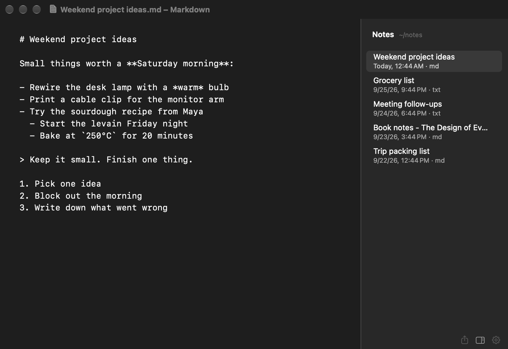
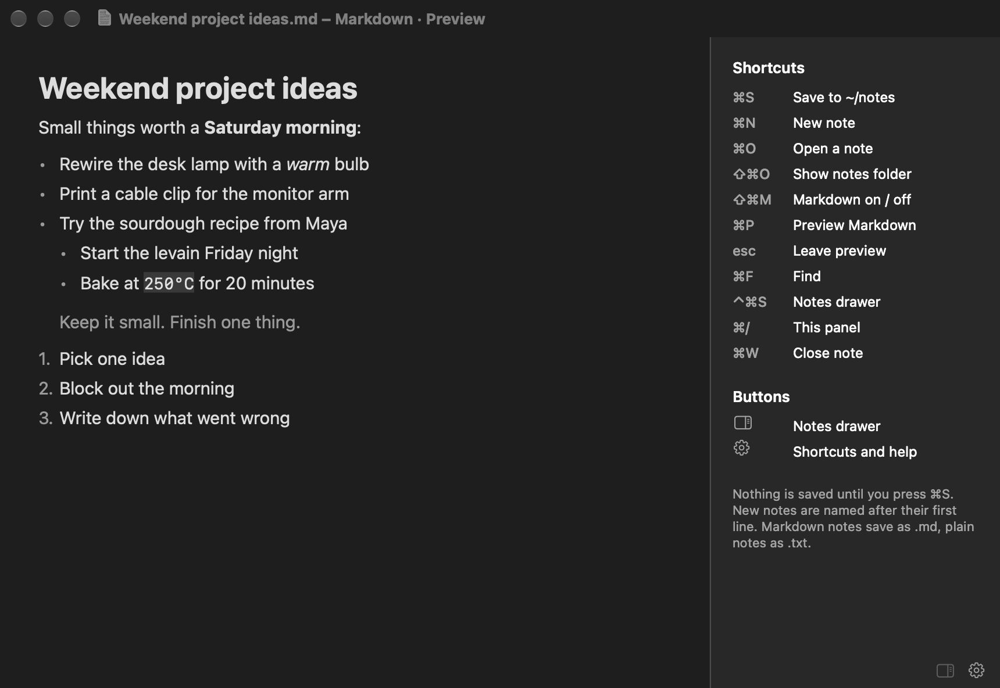

# Jot

A small, minimal plain-text editor for macOS. Think TextEdit without the formatting toolbar and without the save dialog.





- Notes open as plain text. Turn on Markdown per note and preview it with ⌘P.
- Nothing is saved until you press ⌘S. The first save goes straight to `~/notes`, which Jot creates if it does not exist. There is no save dialog.
- Each note is named after its first line, for example `Grocery list.txt`. A blank note gets a timestamp name.
- A drawer lists the notes in `~/notes`, newest first. Click one to open it.
- Share a note by Mail, Messages, or any other macOS share option, or copy it.
- Hover over a note in the drawer and click its X to move it to the Trash. There is no prompt; restore it from the Trash if needed. Unsaved edits in an open window are kept as an untitled note.
- Native AppKit app, no dependencies. Markdown is rendered with Apple's built-in parser.

## Shortcuts

| Keys | Action |
| --- | --- |
| ⌘S | Save to `~/notes` |
| ⌘N | New note |
| ⌘O | Open a note |
| ⇧⌘O | Show the notes folder in Finder |
| ⇧⌘M | Markdown on / off (saves as `.md` or `.txt`) |
| ⌘P | Preview Markdown |
| esc | Leave preview, or close the sidebar |
| ⌘F | Find |
| ⌃⌘S | Notes drawer |
| ⌘/ | Shortcuts panel |
| ⌘W | Close note |

The three faint icons at the bottom right share the note, open the notes drawer, and open the shortcuts panel.

## Build and install

Runs on macOS 14 or later on Apple silicon. Building needs Xcode 26 or later, which compiles the layered app icon. The Command Line Tools alone are not enough.

```sh
git clone https://github.com/zachvivier/jot.git
cd jot
./build.sh            # builds build/Jot.app
./build.sh --install  # also copies it to ~/Applications
```

To keep it in the Dock, open Jot, right-click its Dock icon, and choose **Options → Keep in Dock**.

The icon has a light and a dark version. On macOS 26 and later, the Dock shows the dark version only when **System Settings → Appearance → Icon & widget style** is set to **Dark**. Dark mode alone does not change it. If the Dock still shows an old icon after you rebuild, quit Jot, reopen it, and run `killall Dock` to reload the Dock.

The build is ad-hoc signed, not notarized. A copy you build yourself runs normally. If you copy a built app from another Mac, macOS may block it the first time. Right-click the app and choose **Open** to allow it.

## iPhone

The `iOS` folder holds an iPhone version that shares the note naming and Markdown preview code with the Mac app.

- Notes save as you type, so there is no ⌘S. A note keeps its name in step with its first line until you rename the file elsewhere.
- Notes live in the app's own folder. Open the Files app and go to **On My iPhone › Jot** to see them. They do not sync with the Mac.
- Faint icons at the bottom preview Markdown, share the note, open the notes drawer, and open a menu with New Note, Markdown on or off, and Delete Note.
- The notes drawer slides up from the bottom. Tap a note to open it, or swipe left to delete it. Close the drawer with its ☰ button, by dragging it down, or by tapping the note above it.
- Select text and choose **Format** in the edit menu to make it bold, italic, or struck through. Jot adds the Markdown markers (`**`, `*`, `~~`) and turns Markdown on for the note. Choose the same option again to remove them. Markdown has no underline, so there is no Underline option.
- Autocorrect, smart quotes and dashes, and predictive text are on, as in Apple Notes.
- Share sends the text to Messages, Mail, or Copy. AirDrop sends the file, so a Mac receives `Name.txt`.
- Deleted notes move to **Recently Deleted** inside the Jot folder in Files.

Building needs Xcode 26 or later and [XcodeGen](https://github.com/yonaskolb/XcodeGen) (`brew install xcodegen`).

```sh
cd iOS
xcodegen              # creates Jot.xcodeproj from project.yml
open Jot.xcodeproj    # run on a simulator or a connected iPhone
./release.sh          # archives and uploads a build to TestFlight
```

`release.sh` needs an app record for `io.github.zachvivier.jot` in App Store Connect. It sets the build number from the date and time, so each upload is unique.

## Project layout

| Path | Purpose |
| --- | --- |
| `Sources/AppDelegate.swift` | App lifecycle, menus, opening files |
| `Sources/NoteWindowController.swift` | Editor window, saving, preview, sidebar |
| `Sources/SidebarViews.swift` | Notes drawer, shortcuts panel, bottom buttons |
| `Shared/MarkdownRenderer.swift` | Markdown to styled text for the preview (Mac and iPhone) |
| `Shared/NoteStore.swift` | Notes folder, file naming, note listing (Mac and iPhone) |
| `Shared/Platform.swift` | Font and color names that differ between AppKit and UIKit |
| `iOS/Sources` | iPhone app: editor, notes drawer, autosave, sharing |
| `iOS/project.yml` | XcodeGen spec for the iPhone project |
| `iOS/release.sh` | Archives and uploads the iPhone app to TestFlight |
| `AppIcon.icon` | Layered app icon with light and dark variants. Open it in Icon Composer to edit. |
| `build.sh` | Compiles and bundles `Jot.app` |

## Known limits

The preview uses Apple's Markdown parser. Horizontal rules and task-list checkboxes are not rendered, and tables show as simple tab-aligned columns.

## License

[MIT](LICENSE)
